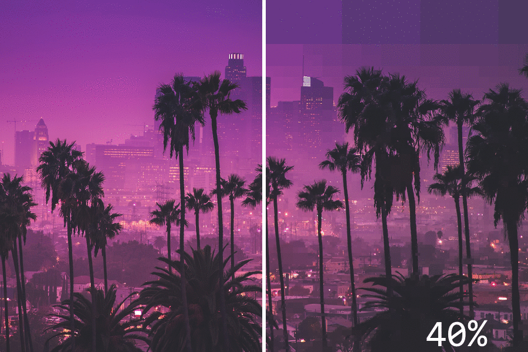
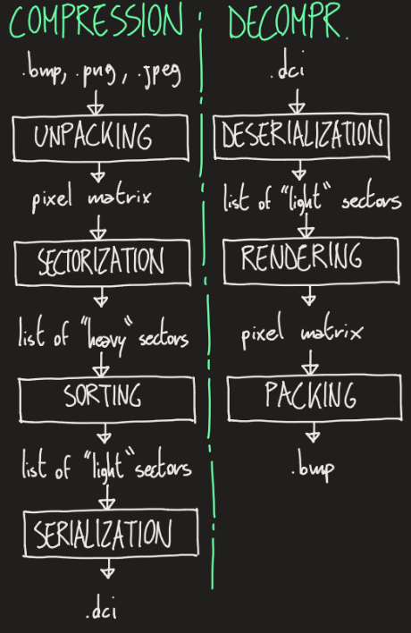
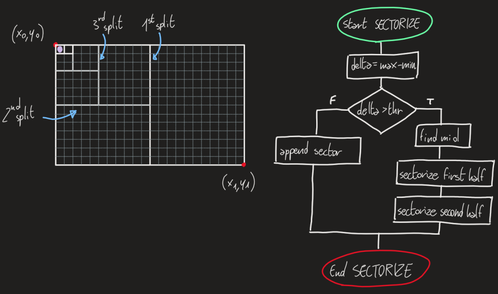
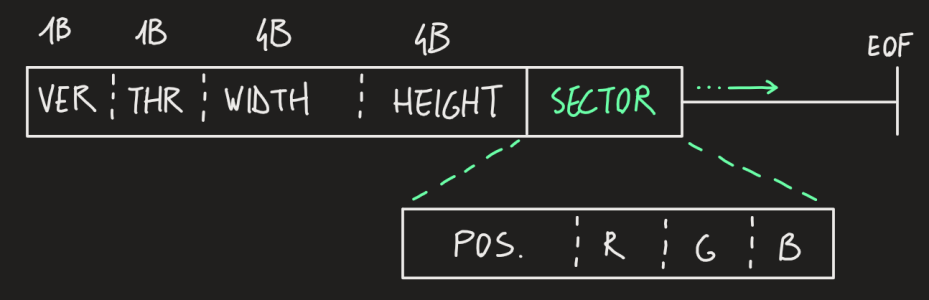

# Dichotomic Compression
Image compression algorithm, developed for research and educational purposes.

## Overview
The dichotomic compression aims to minimize the size of a raster image by dinamically reducing the resolution. It is done by aggregating regions of homogeneous pixels into a single sector. The similarity of the region is regulated by the threshold value (in a range between 0-255).

What emerged from early experiments, is that we can see that the algorithm is best when compressing drawings, sketches, signs or car plates. It prioritizes high contrast details, such as lines, dots and texts.

<i>This examples shows the compressed file size, compared to the original. Custom thresholds have been used.</i>

## Workflow
This workflow doesn't have to implemented strictly: depending on the implementation, some steps can be (or must be) integrated with one another.

## Sectorization
It's the core of the whole process. It's implemented in a recursive function that operates on the pixel matrix. The sectors, when found, are added to a proper list.
The "delta" is a 3-dimensional array, representing the absolute difference between channels of each pixel inside a sector. This mean that "details" (anything that will be preserved as a near original resolution) are usually high contrast regions.

## .DCI format
DCI (dichotmic compression image) is the format chosen to store the compressed image.
- Metadata (10 bytes)
  - version (1 byte): specifies the version used
  - threshold (1 byte): specifies the chosen threshold
  - width (4 bytes): width of the original image
  - height (4 bytes): height of the original image
- Sectors (variable length depending on sectors count and version)
  - size/position: any data that can give information about the position of the sector
  - color channels (RGB)

## .DCI versions
- Version 1
  - Size/position: number of sectorizations done before getting to the sector itself (1 byte)
  - RGB stored as 3 1-byte channels
  - Final sector "weight": 4 bytes (32 bits)
- Version 2 (to be implemented in C)
  - Size/position: number of sectorizations done before getting to the sector itself (7 bits)
  - RGB stored as 3 7-bits channels
  - Final sector "weight": 3.5 bytes (28 bits)

## Usage
The repository only includes the source and the compilation script. In order to use it, you must first compile the source code with `./compile.sh`.

### Command line arguments
Required
- ` -c ` or ` -d `: specifies compression or decompression
- ` -f FILENAME`: specifies which file will be processed

Not required
- ` -t THRESHOLD`: specifies compression threshold
- ` -v `: verbose

### Examples
- ` ./dc_core -c -f ../examples/lines.png -t 30 -v ` Compression (verbose, with custom threshold)
- ` ./dc_core -d -f ../examples/lines.png.dci -v ` Decompression (verbose)
